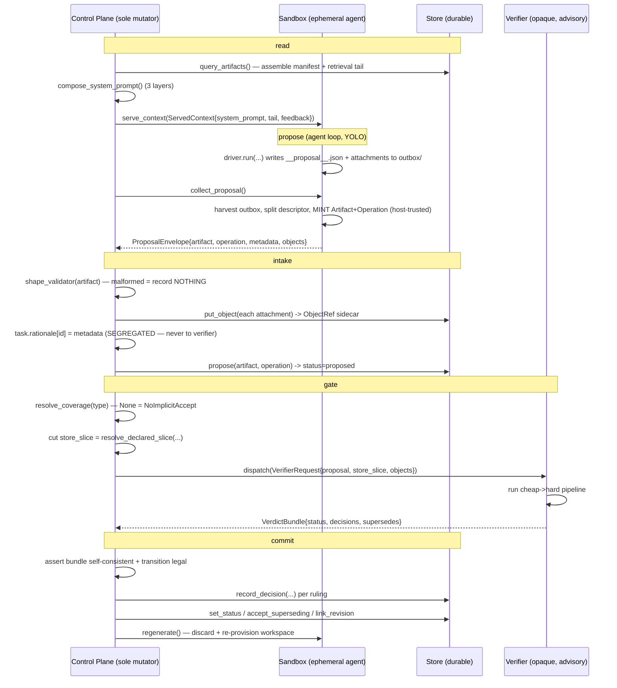
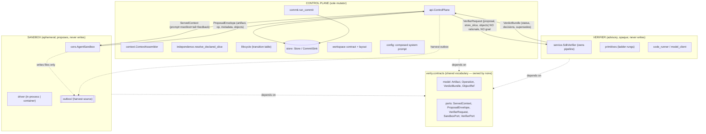

# Context & Component Data-Flow

*An audit of what the Verity components actually look like and what is passed to whom.*

This document is a **reference map of the running system**: the modules, their core data structures
(field-level), and the exact shapes that cross each service boundary per cycle. Every claim cites
`path:line` against source as of branch `docs/api-and-context-audit`. It is descriptive of the code
as written, not the spec's aspiration — where the two differ, this notes it.

Orientation (spec §3.3–§3.6): three services cooperate behind a `read → propose → gate → commit`
loop. The **control plane** is the only service that mutates durable state; the **sandbox** is an
ephemeral agent runtime that proposes but never writes; the **verifier** is advisory and opaque,
returning a verdict bundle. They depend only on a shared contract package (`verity.contracts`),
never on one another (`src/verity/contracts/__init__.py:3`).

---

## 1. Component inventory

### 1.1 `verity.contracts` — the published cross-service vocabulary

The shared kernel both halves depend on, owned by neither (`src/verity/contracts/__init__.py:1`).
Split into two modules:

| Module | Responsibility | Public surface |
| --- | --- | --- |
| `contracts/model.py` | The immutable **value model** — the nouns that travel between services (§4.1). | `ArtifactStatus`, `OperationStatus`, `VerdictKind` enums; `ObjectRef`, `Payload`, `Artifact`, `Operation`, `GateVerdict`, `GateDecision`, `VerdictBundle` |
| `contracts/ports.py` | The async **ports** + the **provider registry** — the service interfaces (§3.3–§3.6). | `ServiceLifecycle`, `VerifierRequest`, `VerifierPort`, `ProposalEnvelope`, `ServedContext`, `SandboxPort`, `ProviderRegistry`, `SANDBOX_PROVIDERS`, `VERIFIER_PROVIDERS` |

The cut is deliberate (`contracts/model.py:8`): only the *boundary-crossing closure* lives here.
Control-plane-internal value types (`Decision`, `SchemaVersion`, `Provenance`) stay with the store.

**Rationale segregation is declared here at the type level.** `ports.py:14-19` states it as an
invariant: a `ProposalEnvelope` carries the agent's `metadata` (how/why), but a `VerifierRequest`
**never** does — its `store_slice` is `tuple[Artifact, ...]`, and `Artifact` has no rationale field,
so "no proposer rationale reaches a gate" holds *by construction*, not by discipline.

### 1.2 `verity.control_plane` — the sole mutator

The only service that mutates durable state; deliberately unintelligent (`control_plane/api.py:3`).

| Module | What it IS |
| --- | --- |
| `store.py` | Durable source of truth over SQLite. Splits a world-facing read/propose `Store` from a privileged write `CommitSink` (§4). |
| `commit.py` | The single privileged route from a `proposed` artifact to durable state — the §7 commit protocol (`run_commit`). |
| `lifecycle.py` | The status state machine: the legal-transition table + terminal-status set (§6). |
| `context.py` | Context assembly — regenerates a bounded projection of the store each turn (§9). |
| `independence.py` | Cuts the declared store-slice a gate may see, and asserts nothing else leaks (§8.3, §10). |
| `registries.py` | The §8 extension seams: schema registry, gated-type registry, retrieval policy. |
| `config.py` | Per-task configuration + the mechanically composed 3-layer system prompt (§3.4). |
| `workspace.py` | The invariant, versioned workspace **contract** + a pluggable on-disk **layout** (§3.4–§3.5). |
| `invariants.py` | The §5 audit invariants as state-checkable functions returning `Violation`s. |
| `api.py` | `ControlPlane` — the async integration layer; configure-by-task, intake, dispatch, cycle control, extraction. |

### 1.3 `verity.sandbox` — the ephemeral agent runtime

Proposes but never writes; writes objects to an outbox for harvest (`sandbox/core.py:1`).

| Module | What it IS |
| --- | --- |
| `core.py` | `AgentSandbox` — the framework-neutral `SandboxPort`. Owns the workspace lifecycle and the trusted harvest/mint half; delegates the agent loop to an injected driver. |
| `driver.py` | `SandboxDriver` protocol — the framework/isolation seam: "run the loop, leave a descriptor + attachments in the outbox." |
| `descriptor.py` | `ProposalDescriptor` — the driver→core boundary JSON (`{op_name, parents, payload, metadata}`). Keeps id/lineage minting on the trusted host side. |
| `deepagents_driver.py` | In-process Deep Agents driver + the shared agent builder; binds one propose-tool per operation. |
| `container_driver.py` | `DeepAgentsContainerDriver` — runs the loop in a fresh, non-root, network-enabled `docker run` per cycle. Imports no Deep Agents. |
| `container_io.py` | `CycleInput` — the framework-neutral host↔container input protocol + fixed mount points. |
| `container_entry.py` | In-container entrypoint: reads `CycleInput`, builds the YOLO agent over a shell-capable backend, runs it. |
| `registration.py` | Factories (`build_deepagents_sandbox`, `build_container_sandbox`) + registry registration. |

### 1.4 `verity.verifier` — the advisory, opaque gate host

Hosts the gate plugins; one proposal in, one verdict out; never writes (`verifier/service.py:1`).

| Module | What it IS |
| --- | --- |
| `service.py` | `SdkVerifier` — the real `VerifierPort`. Owns its per-type pipeline; runs cheap-then-hard checks and returns one `VerdictBundle`. The §6 staging lives here. |
| `primitives.py` | The gate-primitive SDK — the reliability-ladder rungs as composable `(VerifierRequest) -> GateVerdict | None` plugins. |
| `code_runner.py` | The `CodeRunner` port + a `FakeCodeRunner` (offline) and a container-isolated `ContainerCodeRunner` (§3.6). |
| `model_client.py` | The `ModelClient` seam for the LLM-judge rung + `FakeModelClient` / `AnthropicModelClient`. |

### 1.5 `verity.domains` — the wired-in domains

| Module | What it IS |
| --- | --- |
| `fake.py` | A trivial deterministic domain to exercise the contracts. Three types: `Source` (root), `Note` (gated), `Orphan` (gateless — the no-implicit-accept probe). |
| `code.py` | A minimal code-execution domain: a `Submission` gated by a real `ast.parse` check then isolated execution via `auto_code_runner`. The §12 shape, pre-Phase-4. |

A domain object bundles the **control-plane side** (`schema`, `gated_types`, `shape_validator`) and
selects a **verifier package** (the pipeline). `fake.build_fake_verifier()` and the verifier inside
`CodeDomain` are the opaque verifier halves (`domains/fake.py:53`, `domains/code.py:52`).

---

## 2. The data structures that flow between components

This section gives the field-level shape of every type that crosses a boundary, plus the
control-plane-internal persisted types for context.

### 2.1 The value model (`contracts/model.py`)

```python
class ArtifactStatus(StrEnum):          # model.py:37
    PROPOSED · TENTATIVE · ACCEPTED · REJECTED · SUPERSEDED · REVISED

class OperationStatus(StrEnum):         # model.py:48
    SUCCESS · FAILED · RETRIED

class VerdictKind(StrEnum):             # model.py:56
    ACCEPT · REJECT · REFINE

JSONValue = bool | int | float | str | None | list[JSONValue] | dict[str, JSONValue]   # model.py:66

@dataclass(frozen=True, slots=True)
class ObjectRef:                        # model.py:69 — a content-addressed pointer
    blob_ref: str                       #   e.g. "sha256:<hash>"
    content_hash: str

Payload = JSONValue | ObjectRef         # model.py:83 — inline value OR object pointer
```

**Artifact** — the durable noun (`model.py:86`). Frozen: a status change is a *new* row, never an
in-place edit.

| field | type | notes |
| --- | --- | --- |
| `id` | `str` | stable, never reused (§5.1) |
| `type` | `str` | domain type name |
| `payload` | `Payload` | inline JSON or an `ObjectRef`; stored **verbatim**, the control plane never reaches in |
| `status` | `ArtifactStatus` | lifecycle state |
| `created_by` | `str` | the proposer identity (used for proposer≠gate) |
| `created_at` | `str` | ISO-8601 |
| `superseded_by` | `str \| None` | set when superseded (§6, §7) |
| `revised_by` | `str \| None` | set when refined into a revision |
| `is_root` | `bool` | raw-input type → the §5.4 provenance exception |
| `objects` | `tuple[tuple[str, ObjectRef], ...]` | control-plane-owned **sidecar** of harvested attachments (name→ref), distinct from `payload` (`model.py:104`) |

**Operation** — a typed provenance edge (`model.py:110`): `op_id`, `op_name`, `parents:
tuple[str,...]`, `output_id`, `status: OperationStatus`, `created_at`. A `revises` op records a
refine as provenance-bearing work.

**GateVerdict** — one internal check's verdict (`model.py:126`): `kind`, `rationale`, `defects:
tuple[str,...] | None`, `score: float | None`, `supersedes: str | None`. Returned by a *primitive*;
**lives inside the verifier** and is composed into a bundle — it does not cross to the control plane
as-is.

**GateDecision** — one recorded ruling *inside a bundle* (`model.py:142`): `gate`, `kind`,
`rationale`, `defects`, `score`. Self-contained (no artifact id) so it crosses the wire cleanly.

**VerdictBundle** — the verifier's whole reply (`model.py:157`):

```python
@dataclass(frozen=True, slots=True)
class VerdictBundle:
    status: ArtifactStatus                       # the terminal status the verifier RECOMMENDS
    decisions: tuple[GateDecision, ...] = ()     # one per check that ruled
    supersedes: str | None = None                # an incumbent this proposal beats (§7.5a)
```

### 2.2 The boundary ports (`contracts/ports.py`)

**ProposalEnvelope** — a proposal as it arrives *from the sandbox* (`ports.py:122`):

```python
@dataclass(frozen=True, slots=True)
class ProposalEnvelope:
    artifact: Artifact
    operation: Operation
    metadata: str = ""                           # the agent's how/why — the RATIONALE channel
    objects: Mapping[str, bytes] = {}            # what the agent wrote to the outbox
```

> `metadata` is the segregated rationale. It is stored as provenance/context and **kept off** the
> `VerifierRequest` (`ports.py:131-133`).

**ServedContext** — what the control plane hands the sandbox each cycle (`ports.py:107`):

```python
@dataclass(frozen=True, slots=True)
class ServedContext:
    system_prompt: str                           # the stable prefix (composed prompt + manifest)
    manifest: str = ""                           # (declared; currently folded into system_prompt — see §3.1 note)
    tail: str = ""                               # the volatile tail (goal + retrieved artifacts + scratch)
    feedback: str = ""                           # correction from the previous cycle (shape-error or refine defects)
```

**VerifierRequest** — the whole proposal handed to the opaque verifier in one call (`ports.py:70`):

```python
@dataclass(frozen=True, slots=True)
class VerifierRequest:
    proposal: Artifact                           # the artifact under test
    store_slice: tuple[Artifact, ...] = ()       # the declared, control-plane-cut slice (NO rationale field exists)
    objects: Mapping[str, bytes] = {}            # harvested attachments a check may need to EXECUTE
```

> **No `metadata`, no goal, no proposer reasoning.** This is the type-level enforcement of rationale
> segregation: the field simply does not exist on `VerifierRequest`, and `store_slice` is
> `tuple[Artifact]` which carries no rationale. Confirmed by test
> `test_slice_is_artifacts_only_so_no_rationale_can_ride_along` (`tests/test_independence.py:79`):
> `assert all(not hasattr(a, "rationale") for a in got)`.

**The ports** (all `async`, plus a `provision`/`teardown`/`health` lifecycle):

- `VerifierPort` (`ports.py:86`): `identity: str` + `async dispatch(request) -> VerdictBundle`. The
  **only** path to a verdict.
- `SandboxPort` (`ports.py:137`): `serve_context(ctx)`, `collect_proposal() -> ProposalEnvelope`,
  `regenerate()`. *"The sandbox never reaches the verifier or the store"* (`ports.py:143`).
- `ProviderRegistry[PortT]` (`ports.py:157`): config-keyed factory registry. Module-level
  `SANDBOX_PROVIDERS` / `VERIFIER_PROVIDERS` (`ports.py:189`).

### 2.3 The sandbox-internal descriptor (`sandbox/descriptor.py`)

```python
RESERVED_PROPOSAL_NAME = "__proposal__.json"     # descriptor.py:26

@dataclass(frozen=True, slots=True)
class ProposalDescriptor:                         # descriptor.py:29
    op_name: str                                  # the operation the agent declares
    parents: tuple[str, ...]                      # input artifact ids referenced from served context
    payload: JSONValue                            # the domain payload, stored verbatim
    metadata: str = ""                            # the segregated rationale (never reaches the verifier)
```

This is what a (possibly hostile, containerized) agent *declares*; the trusted host mints the typed
`Artifact` + `Operation` from it — the agent cannot forge ids or lineage (`descriptor.py:9`).

### 2.4 The container input (`sandbox/container_io.py`)

`CycleInput` (`container_io.py:30`): `system_prompt`, `user_message`, `operations:
tuple[OperationSignature,...]`, `recursion_limit`. Serialized to one JSON file mounted read-only at
`/sandbox/input.json`; the model spec travels separately via the `VERITY_SANDBOX_MODEL` env var
(`container_driver.py:118`).

### 2.5 Context-assembly shapes (`control_plane/context.py`)

```python
@dataclass(frozen=True, slots=True)
class ManifestEntry:                              # context.py:66 — one payload-FREE index row
    artifact_id: str · type: str · status: ArtifactStatus · summary: str

@dataclass(frozen=True, slots=True)
class Manifest:                                   # context.py:79
    entries: tuple[ManifestEntry, ...] · total: int

@dataclass(frozen=True, slots=True)
class AssembledContext:                           # context.py:93
    stable_prefix: str                            # composed prompt + rendered manifest
    volatile_tail: str                            # goal + retrieved artifacts + scratch
```

`ContextAssembler` (`context.py:108`) carries the bounded-context caps: `manifest_limit=50`,
`tail_limit=12`, `summary_chars=120`, `tail_payload_chars=800`. The manifest `summary` is a
length-capped rendering that, for a dict payload, **shows only the keys, never the values**
(`_summarize`, `context.py:189`; an `ObjectRef` renders as `<object …>`). Confirmed by
`test_manifest_is_payload_free` (`tests/test_context.py:31`).

### 2.6 The workspace contract (`control_plane/workspace.py`)

The **invariant, versioned** role skeleton (`WORKSPACE_CONTRACT_VERSION = 1`, `workspace.py:67`):

| role | access | purpose |
| --- | --- | --- |
| `data` | read-only | the task's data sources |
| `context` | read-only | skills, SOPs, gold-standard examples |
| `tools` | read-only | the task's registered tools |
| `spec` | read-only | the proposal-shape spec / output schema |
| `scratch` | writable-ephemeral | the agent's working space |
| `outbox` | writable-ephemeral | proposal + object attachments; **the harvest source** |

The read-only / writable split makes gold-data isolation physical; `DefaultLayout.provision` refuses
to pre-populate a writable role (`workspace.py:162`), and `harvest` reads *every file in the outbox*
(`workspace.py:182`). `ProvisionedWorkspace` (`workspace.py:109`) is the materialized role→path map.

### 2.7 The composed system prompt (`control_plane/config.py`)

`compose_system_prompt` (`config.py:102`) mechanically assembles **three layers**, deterministic
string assembly, no judgment:

1. **Kernel orientation** (invariant) — the loop, the propose-only contract, the workspace layout
   rendered live from `WORKSPACE_CONTRACT` so it cannot drift, where to write proposals, and how
   shape-errors / refine feedback come back (`KERNEL_ORIENTATION_TEMPLATE`, `config.py:74`).
2. **Domain instructions** (per-domain).
3. **Task instructions** (per-task).

The orientation explicitly tells the agent: *"you never write durable state, and you never contact
the verifier"* and *"write your proposal … to outbox/"* (`config.py:75-84`).

### 2.8 Persisted control-plane-internal types (`control_plane/store.py`)

Never sent to a gate or the sandbox (`store.py:70`):

- **Decision** (`store.py:76`): `artifact_id`, `gate`, `verdict: VerdictKind`, `rationale`,
  `defects`, `score`, `created_at` — one durable row per gate that ruled.
- **SchemaVersion** (`store.py:93`): `version`, `types`, `op_signatures`, `created_at`.
- **Provenance** (`store.py:103`): `artifact`, `operations`, `ancestors`, `decisions` — the
  transitive lineage answering "why do we believe X" without a transcript.

### 2.9 Registry shapes (`control_plane/registries.py`)

- `ArtifactTypeDef` (`registries.py:66`): `name`, `is_root`.
- `OperationSignature` (`registries.py:78`): `name`, `inputs: tuple[str,...]`, `output: str` — typed
  on both sides so operation composition is checkable.
- `GatedTypeRegistry` (`registries.py:151`): maps a gated type → its declared `frozenset[StoreInput]`
  allowlist. `resolve(type)` returns the allowlist or **`None`** if ungated — the no-implicit-accept
  trigger. *There is intentionally no tool registry* (`registries.py:18`); a tool's harness-agnostic
  content is already its `OperationSignature`.

---

## 3. The data-flow narrative — one full cycle

The loop driver is `ControlPlane.run_cycle` (`api.py:277`): serve context → collect proposal →
submit (shape → harvest → propose → commit/dispatch) → regenerate.



### 3.1 read — what the control plane assembles and serves

`serve_context` (`api.py:174`) calls `ContextAssembler.assemble` (`context.py:139`), a **pure
function of the store + the turn's goal/scratch** — regenerate, never append. It produces an
`AssembledContext` with:

- `stable_prefix` = `f"{system_prompt}\n\n{manifest.render()}"` (`context.py:155`). The
  `system_prompt` is the task's composed 3-layer prompt; the manifest is the bounded, ranked,
  **payload-free** index (trusted-and-recent first, `_STATUS_RANK`, `context.py:56`).
- `volatile_tail` = the current goal + the retrieved artifacts (truncated payloads) + optional
  scratch (`context.py:159-167`). Retrieval is driven by the **task's** policy
  (`task.config.retrieval`, `api.py:183`), defaulting to `DefaultRetrievalPolicy` (accepted >
  tentative > rest, recency tiebreak, `registries.py:205`).

It then wraps this into a `ServedContext` and awaits `sandbox.serve_context` (`api.py:185-190`).

> **Note on `ServedContext.manifest`** (resolved, #18 — the field has been removed): historically the
> field existed but `serve_context` constructed the served context with only `system_prompt`
> (=`stable_prefix`, which *already contains* the rendered manifest), `tail`, and `feedback` —
> `manifest` is left default-empty (`api.py:185-189`). The manifest is delivered folded into the
> prefix, not in its own field. Harmless, but the dedicated field is currently dead.

The **bounded-context guarantee** (§9, §13.5) is structural: caps on manifest entries, tail
artifacts, and per-item truncation mean assembled size is independent of store size — proven by
`test_bounded_context_guarantee_size_does_not_grow_with_store` (`tests/test_context.py:39`): 40× the
artifacts, `< 50` chars difference.

### 3.2 propose — what the sandbox runs and writes to the outbox

`AgentSandbox.collect_proposal` (`core.py:105`):

1. Builds a user message from the served `tail` + `feedback` + a fixed instruction to "call exactly
   one operation tool to submit your proposal" (`_user_message`, `core.py:172`).
2. Runs the injected `driver.run(system_prompt, user_message, operations, workspace)`
   (`core.py:111`). The driver runs the agent loop and leaves a descriptor + attachments in the
   outbox; it **returns nothing** (`driver.py:23`).
   - In-process (`DeepAgentsInProcessDriver`, `deepagents_driver.py:79`): a Deep Agents agent with a
     **plain `FilesystemBackend`** (file tools only, no working `execute`) — dev/test, must not run
     untrusted code on the host.
   - Container (`DeepAgentsContainerDriver`, `container_driver.py:45`): a fresh `docker run` per
     cycle with a shell-capable `LocalShellBackend` so the agent can write *and run* code; the
     **container is the safety boundary** (YOLO, no permission prompts).
   - Either way, each domain `OperationSignature` is bound to one **propose tool** that writes
     `ProposalDescriptor.to_json()` to `outbox/__proposal__.json` (`deepagents_driver.py:114-128`).
     Its `rationale` arg is documented "never shown to the verifier" (`deepagents_driver.py:138`).
3. **Harvests** the outbox via the layout (`core.py:118`), **splits** the reserved descriptor file
   from the attachments (`core.py:119`), and **mints** the typed `Artifact` + `Operation` from the
   schema, an injected clock, and an injected id-source (`_mint`, `core.py:138`). The agent never
   mints ids, never sees the store. `created_by` is the sandbox's `proposer_identity`
   (distinct from the verifier).

Result: a `ProposalEnvelope{artifact (proposed), operation, metadata, objects}` returned to the
control plane (`core.py:165`).

### 3.3 intake — what the control plane harvests and records

`submit_proposal` (`api.py:195`), in order:

1. **Shape check (§7.0):** `task.config.shape_validator(artifact)`. If it fails, return
   `IntakeResult(entered_protocol=False, shape_error=…)` and **record nothing** — no harvest, no
   `proposed` row, no decision (`api.py:203-206`). The verifier is never triggered.
2. **Harvest before teardown:** each outbox object is content-addressed into the object store via
   `put_object` → `ObjectRef` (`api.py:210`). This is the hard ordering constraint.
3. **Object sidecar:** the refs are attached to the artifact's `objects` field (a control-plane
   sidecar; the domain `payload` is untouched, `api.py:214-218`).
4. **Rationale segregation:** `if envelope.metadata: task.rationale[artifact.id] = envelope.metadata`
   (`api.py:221-222`) — stored on `TaskState.rationale`, a per-task dict, **never** passed into the
   dispatch closure. Retrievable only via `ControlPlane.rationale_for` (`api.py:328`).
5. `store.propose(artifact, operation)` (`api.py:224`), link a revision if the op is `revises`
   (`api.py:262`), then run the commit path.

### 3.4 gate — what the control plane shapes and dispatches to the verifier

The dispatch closure inside `_run_commit` (`api.py:241-249`) is the **only** path to the verifier:

```python
def dispatch(artifact: Artifact) -> VerdictBundle:
    declared = task.config.gated_types.resolve(artifact.type) or frozenset()
    request = VerifierRequest(
        proposal=artifact,
        store_slice=resolve_declared_slice(self._store, artifact, declared),
        objects=bound_objects,
    )
    future = asyncio.run_coroutine_threadsafe(task.verifier.dispatch(request), loop)
    return future.result()
```

- **What is attached:** the proposal artifact, the cut store-slice, and the harvested `objects` (so
  an executing check can run the submitted code).
- **How the slice is selected:** `resolve_declared_slice` (`independence.py:65`) assembles *exactly*
  the gate's declared `StoreInput`s — `INCUMBENTS` (accepted artifacts of the same type) and/or
  `REJECTED_LOG` (rejected of the same type) — via `STORE_INPUT_PROVIDERS` (`independence.py:57`). A
  gate declaring **none** gets an empty slice (only the artifact under test). It then asserts every
  resolved item's source is within the declared allowlist, raising `IndependenceViolation` otherwise
  (`independence.py:86-91`) — the §10 audit, before dispatch.
- **What is withheld:** the proposer's rationale (segregated, above), the goal, sibling state the
  gate did not declare, and any other-typed or wrong-status artifacts. Pinned by the independence
  tests (`tests/test_independence.py:55-120`).

The sync commit path runs in a worker thread (`asyncio.to_thread`, `api.py:251`) while the API
awaits the async verifier; the store is the sole serialized mutator, so the crossing is safe
(`store.py:274-277`).

**Inside the verifier** (`SdkVerifier.dispatch`, `service.py:68`): it looks up the per-type pipeline
(a missing pipeline is a loud config error, never a silent pass, `service.py:71-76`), records the
request for test assertions, and runs `_run_pipeline` (`service.py:89`):

- Cheap checks (`is_hard=False`) then hard checks (`is_hard=True`).
- First `REJECT` → `VerdictBundle(REJECTED, …)`; first `REFINE` → `VerdictBundle(REVISED, …)`
  (short-circuit, `service.py:105-108`).
- A hard check returning `None` (a `requires_human` plugin) means it could not auto-resolve → rest at
  `TENTATIVE` (`service.py:110-112`).
- All cheap cleared, all hard cleared → `ACCEPTED`, carrying any `supersedes` (`service.py:114`).

The primitives (`primitives.py`) are the ladder rungs: `deterministic_check` (rung 2),
`numeric_scorer` (rung 1, accept iff net-of-cost beats the incumbent read from the slice,
`primitives.py:104`), `llm_judge` (rung 4, **labeled weak**, `primitives.py:143`), `auto_code_runner`
(executes the attachment in isolation, `primitives.py:182`), `human_in_the_loop` (returns `None`,
`primitives.py:225`), `model_tester` (Phase-4 seam, raises `NotImplementedError`, `primitives.py:238`).

### 3.5 commit — how the commit path consumes the verdict

`run_commit` (`commit.py:148`):

1. Load the artifact; require `status == proposed` (`commit.py:163-169`).
2. **No implicit accept (§5.7):** `resolve_coverage(type) is None` ⇒ `NoImplicitAccept`
   (`commit.py:172`).
3. **Proposer ≠ gate (§7.2):** `verifier_identity == artifact.created_by` ⇒ `ProposerIsGate`
   (`commit.py:176`).
4. **One handoff:** `bundle = dispatch(artifact)`, then `_assert_consistent` — a reject decision
   under a non-rejected status (or refine under non-revised) is `BundleInconsistent`
   (`commit.py:224-234`). This is *coherence checking, not judgment*.
5. **Record + enforce:** write a `Decision` row per ruling (`commit.py:185-196`); validate
   `assert_transition(PROPOSED, bundle.status)` against `LEGAL_TRANSITIONS` (`commit.py:200`,
   `lifecycle.py:32`); then set status:
   - `REJECTED` → `set_status` (`commit.py:202`).
   - `REVISED` → `set_status` + return the localized `defects` (`commit.py:206-209`).
   - `TENTATIVE` → ensure provenance, `set_status` (`commit.py:211`).
   - `ACCEPTED` → ensure provenance, `_accept`: if the bundle names `supersedes`, verify the
     incumbent and `accept_superseding` atomically; else plain `set_status(ACCEPTED)`
     (`commit.py:216`, `_accept` `commit.py:237`).

`_ensure_provenance` (`commit.py:259`) refuses to accept/tentative a non-root artifact with no
operation edge (§5.4). All status writes go through `CommitSink`, gated by the legality table — *no
illegal edge can be written even by this privileged path, or by the verifier's bundle*
(`commit.py:160`).

### 3.6 status transitions and what is recorded

The legal table (`lifecycle.py:32`):

| from | may move to |
| --- | --- |
| `proposed` | `tentative`, `accepted`, `rejected`, `revised` |
| `tentative` | `accepted`, `rejected`, `revised`, `superseded` |
| `accepted` | `superseded` |
| `rejected` / `superseded` / `revised` | — (terminal) |

`accepted` is **not** terminal (it can still be superseded); `rejected`/`superseded`/`revised` are
terminal and *retained* (`lifecycle.py:43`). Recorded per commit: a `decisions` row per ruling, the
new `status`, and the replacement pointers (`superseded_by` / `revised_by`) where applicable. The
result surfaces as a `CommitResult{outcome, artifact_id, status, defects, decisions}`
(`commit.py:100`) wrapped in an `IntakeResult{entered_protocol, shape_error, commit, harvested}`
(`api.py:80`).

### 3.7 the run loop and feedback

`run` (`api.py:287`) drives cycles until `OrchestrationPolicy.should_continue` (default
`max_cycles=20`, `api.py:96`) stops, optionally short-circuiting on accept (`stop_on_accept`). Each
cycle's **correction** is fed into the next cycle's served context (`_feedback_from`, `api.py:336`):
a `shape-error: …` when the proposal was malformed, or `refine: <defects>` after a refine verdict —
so the agent can fix formatting or produce a tracked revision. `refine_cap` (default 3) bounds refine
loops and is **enforced per lineage at commit** (issue #17): once a lineage has been refined
`refine_cap` times, a further refine terminates it in `rejected` (`_count_lineage_refines` →
`run_commit(refine_exhausted=…)`). `_feedback_from` only emits `refine:` feedback on a `revised`
outcome, so a rejected lineage is not invited to revise.

---

## 4. Boundary / isolation facts — traced to code

### 4.1 Only the control plane mutates durable state

The store splits two protocols (`store.py:147-193`):

- **`Store`** (world-facing): reads + `propose` + objects + provenance. *Carries no method that
  overwrites a payload, hard-deletes, or sets status/decisions* (`store.py:151-154`).
- **`CommitSink`** (privileged): `record_decision`, `set_status`, `accept_superseding`,
  `link_revision`, `register_schema_version`. *Held only by the commit path* (`store.py:181-187`).

`run_commit` is the single caller threaded both `store` and `sink` (`api.py:251-257`, both happen to
be the same `SqliteStore`, but domain/agent code is only ever typed to `Store`). The sandbox and
verifier are handed neither — they receive only value objects across the ports. The privileged-mutator
boundary of §3.3 is **structural, not conventional** (`store.py:12`).

### 4.2 The sandbox can reach neither the verifier nor the store

- `SandboxPort` (`ports.py:137`) exposes only `serve_context` / `collect_proposal` / `regenerate` +
  lifecycle. No verifier handle, no store handle. The docstring states it: *"The sandbox never
  reaches the verifier or the store"* (`ports.py:143`).
- `AgentSandbox` (`core.py:60`) is constructed with a `driver`, a `schema`, a `proposer_identity`,
  and a workspace root — **no verifier, no store, no `CommitSink`** reference exists on it.
- The agent communicates outward *only* by writing files to `outbox/`, which the host harvests
  (`core.py:118`). The composed prompt tells the agent it "never contacts the verifier"
  (`config.py:75`).
- In the container driver, isolation is also **physical**: non-root host-uid, all caps dropped,
  `no-new-privileges`, read-only root + tmpfs, memory/CPU/PID limits, timeout-kill; gold-data is
  re-mounted read-only on top of the writable `/work` (`container_driver.py:96-127`). The agent only
  *declares* the operation in a descriptor — it cannot forge ids or lineage (`descriptor.py:9`).

### 4.3 The verifier sees no rationale (and no undeclared store state)

Two independent enforcements, both at the **type level** rather than by discipline:

1. **No rationale field on the wire.** `VerifierRequest` (`ports.py:70`) has only `proposal`,
   `store_slice`, `objects`. The agent's `metadata` lives on `ProposalEnvelope` and is diverted to
   `TaskState.rationale` at intake (`api.py:221-222`); it is never referenced by the `dispatch`
   closure (`api.py:241-247`). The `store_slice` is `tuple[Artifact]`, and `Artifact` has no
   rationale field — so even a malicious gate cannot read proposer reasoning. Asserted by
   `tests/test_independence.py:79`. The `ModelClient` seam reinforces this: the judge is handed only
   the artifact + slice, *"never the proposer's rationale"* (`model_client.py:10-12`,
   `primitives.py:149-151`).
2. **No over-broad store context.** `resolve_declared_slice` (`independence.py:65`) gives a gate
   *exactly* its declared `StoreInput`s and asserts the resolved sources ⊆ the declared allowlist
   before dispatch (`independence.py:86`). A declared input with no provider is a loud
   `IndependenceViolation`, never a silently-empty slice (`independence.py:78`). The property holds
   under Hypothesis (`tests/test_independence.py:107`).

The verifier also carries an `identity` distinct from the proposer (`VerifierPort.identity`,
`ports.py:96`), enforced at commit (`commit.py:176`) — the Builder/Breaker rule.

### 4.4 Component-boundary diagram



Note the dependency graph never points service-to-service: every arrow of *code dependency* goes
through `verity.contracts` (`contracts/__init__.py:3`). The only runtime arrows between services are
the four value objects above.

---

## 5. Quick reference — what crosses each boundary

| Boundary | Direction | Type | Carries | Deliberately excludes |
| --- | --- | --- | --- | --- |
| CP → Sandbox | serve | `ServedContext` | composed system prompt + manifest, retrieval tail, prev-cycle feedback | the raw store; full payloads (manifest is payload-free) |
| Sandbox → CP | collect | `ProposalEnvelope` | minted `Artifact`+`Operation`, agent `metadata`, outbox `objects` | (nothing withheld — host trusts its own mint) |
| CP → Verifier | dispatch | `VerifierRequest` | the proposal, the declared store-slice, object attachments | **proposer rationale**, the goal, undeclared store state |
| Verifier → CP | reply | `VerdictBundle` | recommended terminal status, per-check decisions, `supersedes` | (it advises only; CP sets status) |
| Sandbox internal | driver→host | `ProposalDescriptor` (file) | `op_name`, `parents`, `payload`, `metadata` | minted ids/lineage (host-only) |

---

*Sources audited: `contracts/{model,ports}.py`; `control_plane/{store,lifecycle,commit,context,
independence,workspace,config,registries,invariants,api}.py`; `sandbox/{core,driver,descriptor,
deepagents_driver,container_driver,container_io,container_entry,registration}.py`;
`verifier/{service,primitives,code_runner,model_client}.py`; `domains/{fake,code}.py`; confirmed
against `tests/{test_context,test_independence,test_workspace}.py` and `tests/helpers.py`.*
